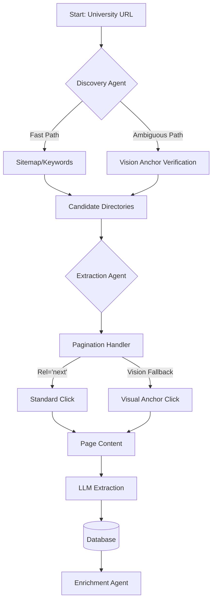

# Insti-Scraper Professional

**The High-Performance, Agentic Faculty Data Extraction Engine**

[](https://www.python.org/downloads/)
[](https://opensource.org/licenses/MIT)

Insti-Scraper is an advanced, autonomous scraping system designed to extract high-fidelity professor profiles from university websites. Unlike traditional regex-based scrapers, it uses **Multimodal LLMs (Vision Anchors)** to "see" and understand page structures, allowing it to navigate complex, modern web applications (React, Angular, DataTables) that standard tools miss.

---

## 🌟 Core Capabilities

### 🧠 Agentic Discovery
- **Auto-Detection**: Give it a university home page (e.g., `mit.edu`), and it autonomously finds the faculty directory.
- **Smart Filtering**: Distinguishes between *actual* faculty lists and "news" or "events" pages using semantic analysis.

### 👀 Vision Anchors (The "Secret Sauce")
- **Lazy Evaluation Architecture**: To minimize costs, Vision APIs (GPT-4o) are only triggered when standard methods fail.
    - **Visual Discovery**: Visually confirms ambiguous pages ("Is this a directory or a blog post?").
    - **Visual Pagination**: Finds non-standard "Next" buttons (icons, lazy-loaded divs) that lack HTML attributes.
    - **Visual Extraction**: Reverse-engineers CSS selectors by identifying visual patterns of names on the page.

### 🛡️ Robust Extraction
- **Garbage Filtering**: Automatically removes staff, admins, and students to keep the dataset clean.
- **Rich Data**: Extracts Name, Title, Email, Profile URL, Research Interests, and Publications.
- **Enrichment**: (Optional) Cross-references data with Google Scholar for H-Index and Citation counts.

---

## 🛠️ Architecture Overview



> **Note**: An editable version of this diagram is available at `docs/architecture.drawio` (VS Code Draw.io Extension compatible).

---

## 🚀 Installation

> [!TIP]
> **New to coding?** Read our [Simplified User Guide](file:///home/bakasur/Downloads/instiGPT/USER_GUIDE.md) for a step-by-step walkthrough.

### Prerequisites
- Python 3.10+
- `uv` (recommended) or `pip`
- Standard unix tools (Linux/macOS)

### Setup

1.  **Clone Request**:
    ```bash
    git clone https://github.com/your-repo/instigpt.git
    cd insti-scraper
    ```

2.  **Install & Setup**:
    ```bash
    make install
    ```

3.  **Environment Configuration**:
    Create a `.env` file in the root directory:
    ```ini
    # Required: For Vision and Extraction APIs
    OPENAI_API_KEY=sk-proj-xxxxxxxxxxxxxxxxxxxxxxxx

    # Optional: For local LLM inference
    # OLLAMA_BASE_URL=http://localhost:11434
    
    # Optional: Database path
    DATABASE_URL=sqlite:///faculty.db
    ```

---

## 📖 CLI Reference

The application can be run via `make` (recommended) or the unified CLI endpoint: `python -m insti_scraper`

### Quick Start with Makefile
| Command | Description |
|:---|:---|
| `make install` | Install all dependencies |
| `make run URL=...` | Scrape a university (Auto-Discover) |
| `make direct URL=...` | Scrape a specific list directly |
| `make discover URL=...` | Discovery Only (debug links) |
| `make list` | View current data |
| `make csv [FILE=...]` | Export to CSV |
| `make test` | Run all tests |

---

### 1. `scrape` - The Main Engine
Scrape a single university or specific department.

```bash
python -m insti_scraper scrape [URL] [OPTIONS]
```

**Arguments:**
| Argument | Description | Default |
|:---|:---|:---|
| `url` | Target URL (University Homepage or Faculty List) | Required |
| `--no-enrich` | Skip Google Scholar enrichment step | False |
| `--direct`, `-d` | **Direct Mode**: Treat URL as the final directory. Skips discovery phase. | False |

**Example:**
```bash
# Auto-discover from homepage
python -m insti_scraper scrape "https://www.stanford.edu"

# Scrape a specific known list directly
python -m insti_scraper scrape "https://www.cs.princeton.edu/people/faculty" --direct
```

### 2. `discover` - Discovery Only
Run *only* the discovery phase to find potential directory URLs without scraping them. Useful for debugging or building a seed list.

```bash
python -m insti_scraper discover [URL] [OPTIONS]
```

**Options:**
- `--mode`: Strategy to use.
    - `auto` (Default): Hybrid approach (Keywords -> Sitemap -> Vision).
    - `sitemap`: Only check sitemap.xml.
    - `deep`: Deep crawl with domain filtering.
    - `search`: Use DuckDuckGo to search for "University Name Faculty".

**Example:**
```bash
python -m insti_scraper discover "https://www.mit.edu" --mode auto
```

### 3. `batch` - Production Processing
Process thousands of universities from an Excel sheet.

```bash
python -m insti_scraper batch [EXCEL_FILE] [OPTIONS]
```

**Arguments:**
- `excel`: Path to `{university, url}` excel file.
- `--output`: Directory to save results.
- `--limit`: Max number of universities to process (for testing).

### 4. `list` - View Data
View the currently scraped data in the database.

```bash
python -m insti_scraper list
```

### 5. `csv` - Export Data
Export the SQLite database to a CSV file for analysis.

```bash
python -m insti_scraper csv --output results/faculty_2026.csv
```

---

## 📂 Project Structure

```text
insti_scraper/
├── engine/              # Core Scraping Logic
│   ├── discovery.py     # Faculty Discovery Agent
│   ├── page_handlers.py # Page-type specialized logic
│   └── pagination.py    # Standard & Vision pagination
├── data/                # Data Persistence
│   ├── models.py        # SQLModels for Prof/Dept/Uni
│   └── database.py      # SQLite/SQLAlchemy setup
├── core/                # System Utilities
│   ├── selector_gen.py  # Visual Anchor reverse-engineering
│   ├── auto_config.py   # Page analysis & meta-detection
│   └── rate_limiter.py  # Polite scraping logic
├── services/            # High-level API Services
│   ├── extraction.py    # LLM-augmented data mining
│   └── enrichment.py    # Google Scholar integration
└── main.py              # CLI Entrypoint
```

---

You can import core components to build custom pipelines.

```python
import asyncio
from insti_scraper.engine.discovery import FacultyPageDiscoverer
from insti_scraper.services.extraction_service import ExtractionService

async def custom_pipeline():
    # 1. Discover
    discoverer = FacultyPageDiscoverer()
    result = await discoverer.discover("https://www.yale.edu")
    
    # 2. Extract
    service = ExtractionService()
    for page in result.faculty_pages:
        # Use Vision-augmented extraction
        profs, dept = await service.extract_with_fallback(page.url, html_content)
        print(f"Found {len(profs)} in {dept}")

if __name__ == "__main__":
    asyncio.run(custom_pipeline())
```

---

## 📊 Output Data Schema

The system extracts the following fields for every profile:

```json
{
  "name": "Dr. Jane Doe",
  "title": "Associate Professor",
  "email": "jane.doe@univ.edu",
  "profile_url": "https://univ.edu/faculty/jane-doe",
  "website_url": "https://univ.edu",
  "department": "Computer Science",
  "research_interests": ["Machine Learning", "Computer Vision"],
  "h_index": 45,            // Enriched
  "total_citations": 3420,  // Enriched
  "publication_summary": "..."
}
```

---

## 🔧 Troubleshooting

### Vision Rejection (`❌ Vision rejected`)
If discovery keeps rejecting a valid URL:
1.  The page might look "sparse" (no photos).
2.  **Fix**: Use `make direct URL=...` to force the scraper to accept the URL.

### No faculty found
If the scraper finds nothing:
1.  Run `make discover URL=...` to see all potential links found.
2.  If you see a valid list in the terminal, copy it and run `make direct URL=[THAT_LINK]`.

### Rate Limits
If you see `429 Too Many Requests`:
1.  The `RateLimiter` ensures polite scraping.
2.  Increase delays in `insti_scraper/core/rate_limiter.py`.

---

## 📜 License

MIT License. See `LICENSE` for details.
